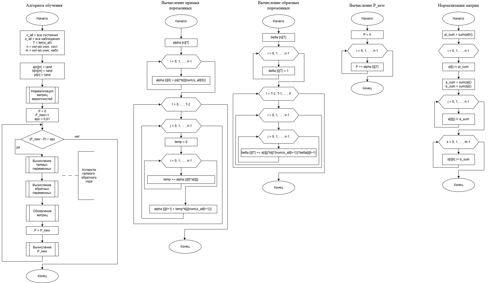
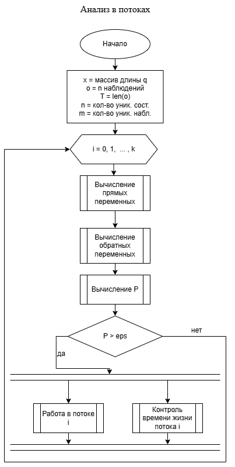

# Диаграммы проекта

В этом разделе представлены визуальные схемы, описывающие логику работы системы и алгоритмов, используемых в проекте.

## `training_algorithm.png` — Алгоритм обучения HMM

Схема описывает полный цикл обучения скрытой марковской модели (HMM), включающий:

- Инициализацию параметров: `a[n][n]`, `b[n][m]`, `p[n]`;
- Нормализацию вероятностей;
- Цикл обучения до сходимости:
  - Вычисление прямых (`alpha`) и обратных (`beta`) переменных;
  - Обновление параметров;
  - Перерасчёт лог-вероятности `P_new`.

Используются алгоритмы **EM** и **прямо-обратный проход** для уточнения параметров.

---

## `stream_analysis.png` — Анализ в потоках

Схема описывает обработку данных в многопоточном режиме:

- Каждому потоку `i` передаётся своя последовательность наблюдений;
- Производится вычисление `alpha`, `beta`, расчёт вероятности `P`;
- При условии `P > ε` запускается:
  - анализ в потоке;
  - контроль времени жизни потока.

Это полезно для корреляции в **реальном времени** и потоковой корреляции событий.

